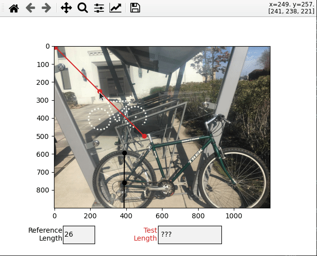

# Relative Length Measurer

Tiny tool to measure lengths in an image relative to a known distance in the image. I use it for measuring bike sizes when craiglist posts don't list how big the bike is :angry:.

It's possible other tools exist to do this. If you know of one please open an issue! I'd really like a simple webpage to do this on rather than opening python.




## Try it out yourself

```bash
git clone https://github.com/ianhi/relative-length-measurer
cd relative-length-measurer
pip install -r requirements.txt
python photo_measure.py
```

## Using the draggable line

The `DraggableLine` class here seems pretty useful - I hope to add it to matplotlib. See https://github.com/matplotlib/matplotlib/issues/22682
